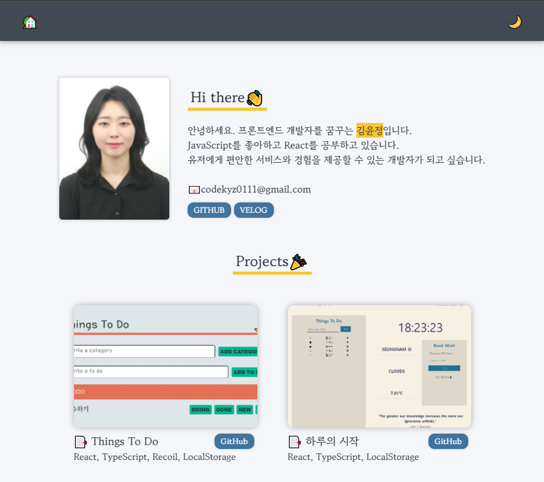

# Portfolio

## 개요

`React` `TypeScript` `styled-components` `recoil`

- 개인 포트폴리오입니다.

## 기능

- GitHub와 Velog Link를 제공합니다.
- 개인 Project를 모아서 보여줍니다.
- 프로젝트 Thumbnail을 누르면 해당 웹 앱으로 이동합니다.
- 프로젝트 GitHub 저장소를 제공합니다.
- 다크모드를 지원합니다.
- Notion 이력서를 제공합니다.
